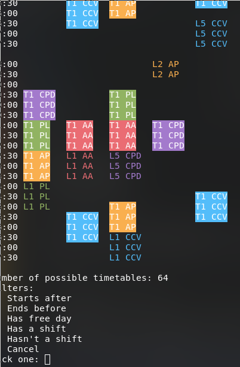
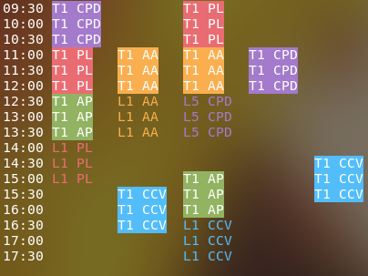

# Scheduler

Make nice csv like this
```
Course:Shift:Start:End:DayOfWeek
```
Where:
 - `Course` can be any string
 - `Shift` can be LX or TX (for lab or thoretical) and `X` it's number
 - `Start` is a time in the following syntax `HHhMM`
 - `End` is a time in the same syntax
 - `DayOfWeek` is either `Mon`, `Tue`, `Wed`, `Thu`, `Fri`, `Sat` or `Sun`

## Example
```
PL:L1 :08h00:10h00:Mon
PL:T1 :10h00:12h00:Mon
CPD:T1:11h00:13h00:Tue
```

Then run program and pass csv as arg
```
cargo run --release -- shifts.csv
```

Program will produce all possible schedules and you can filter some out




And get nice schedule like this:




